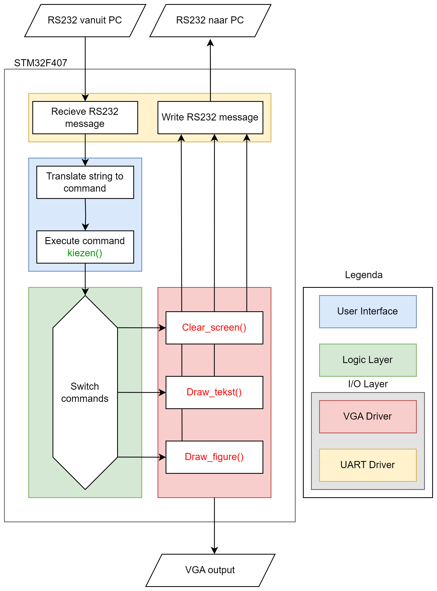

# 23.24-D-Softwareontwikkeling
jaar 23/24 periode D Software Ontwikkeling

# Project Description
The demo application follows the 3-Tier model and showcase the EE-API-LIB functions in the third layer. It will execute commands from a scripting language with the following structure:

Front Layer: Reads script commands.
Logic Layer: Contains drawing functionality.
I/O Layer: Manages input and output to the hardware.
By completing this project, We will deliver a fully operational solution with the EE-API-library and a client application, along with comprehensive documentation and professional source code. This will enable IP’s in-house programmers to gain practical experience with the new VGA screens.

## Team members
- Michel Vollmuller
- Tim Wannet
- Tijmen Willems

## Project workflow
- **Development Tools**: Visual Studio Code, Git, GitHub Desktop and Gitkraken.
- **Methodology**: Scrum with Github as scrum board. (https://github.com/users/Ragazzoforte/projects/2/views/1)
- **Communication Tools**: WhatsApp and GitHub (scrum).
- **Documentation Tools**: Doxygen and GitHub. (https://ragazzoforte.github.io/23.24-D-Softwareontwikkeling/)
- **Version Control**: GitHub
- **Coding Standards**: C++ Coding Standards

# Project rules

## Branches
From every issue, a new branch will be created. The branch name will be the same as the issue name. The branch will be merged into the main branch after the issue is completed. Every branch will be deleted after merging.

A Branch name should always start with the following prefixes:

- Feature Branches: feature/. 

- Bugfix Branches: bugfix/. 
- Hotfix Branches: hotfix/.
- Release Branches: release/.
- Documentation Branches: docs/.

# Manual

## 3-layer model
The 3-layer model, also known as the layered architecture, is a software design pattern that separates the functionality of a program into three distinct layers: the user interface (UI) layer, the logic layer, and the I/O (input/output) layer. Each layer has a specific responsibility and interacts with the other layers in a controlled manner.

1. User Interface (UI) Layer:
The User Interface Layer the topmost layer of the application and is the only layer that interacts directly with the user. The UI Layer is responsible for displaying the user interface, handling user input, and presenting the output of the program to the user. It is also responsible for translating user input into commands that can be understood by the logic layer.

2. Logic Layer:
The logic layer contains the core functionality and business logic of the program. Here the commands are translated into their respective functions. 
The layer can utilize text, fonts and bitmaps to draw on the screen. 

3. I/O (Input/Output) Layer:
The I/O Layer handles the communication between the program and the user. It is responsible for reading input data from a command line and writing data to the command line.
This layer abstracts the details of the underlying I/O operations, providing a consistent interface for the logic layer to interact with different data sources.
Input and output data is being handled by the SerialPort_Terminal.exe program that connect via serial to the STM32F407VG microcontroller.
The layer also handles the communication between the program and the VGA screen to display the output.
The VGA screen is connected to the microcontroller via a VGA cable.
To optimise modularity the i/o layer is seperated in 2 sections: the UART driver and the VGA driver.

By separating the concerns into different layers. The 3-layer model promotes modularity, reusability, and maintainability of the code. It allows for easier testing, as each layer can be tested independently. It provides a clear separation of responsibilities, making the code easier to understand 
and modify.

## Graphical Design

From the image above you can see the 3-layer model representeted in a high level design.
As explained in the last chapter the 3-layer model is separated in 4 different parts: User Interface, Logic Layer, VGA Driver and UART Driver.

1. User Interface
The User Interface (blue) is represented by 2 blocks in the HLD: "Translat_string_to_command" and "Execute_command: kiezen()".
It recieves a string from the terminal by the UART Driver, translates this string to a command and calles the fuction defined in the Logic Layer.

The User Interface is being handled by the following files:
- user_interface.c/h: mostly handles the incoming string and translates this to the respected function.

2. Logic Layer
Inside the Logic Layer (green) the incoming command from the User Interface. Here the command is being translated to the correct function that is defined in the VGA Driver. The Logic Layer also defines the fonts and bitmaps that are being used in the program.

The Logic Later is being handled by the following files:
- Logic_layer.c/h: Chooses the correct function based on the incoming message (from uart.c/h)
- font.c/h: Contains all the fonts that are being used in the program.
- bitmap.c/h: Contains all the bitmaps that are being used in the program.

3. VGA Driver
The VGA Driver (red) is the layer that is responsible for drawing on the screen.
Errors are being handled in the driver and send to the UART Driver to be displayed on the terminal.
The switch case from the Logic Layer refers to 3 functions in the VGA Driver, these are example functions and represent all the functions that are defined in the VGA Driver.

The VGA Driver is being handled by the following files:
- vga_driver.c/h: Has all functions that are being used to draw on the screen or are being used to help the functions.

4. UART Driver
This Layer (yellow) is used for the communication between the terminal and the User Interface. It recieves the incoming string from terminal and sends the errors back received from the VGA Driver. 

The UART Driver is being handled by the following files:
- uart.c/h: With the lack of HAL libraries there was the need of making a own UART program so the microcontroller could communicate with the terminal. This program is optimized to minimize stuttering, minimize sync issues and optimize speed.

## Scipts-commands
- lijn, x, y, x’, y’, kleur, dikte
- rechthoek, x_lup, y_lup, breedte, hoogte, kleur, gevuld (1,0) [als 1: rand (1px) met kleur]
- tekst, x, y, kleur, tekst, fontnaam (arial, consolas), fontgrootte (1,2), fontstijl (normaal,
vet, cursief)
- bitmap, nr, x-lup, y-lup [tenminste: pijl (in 4 richtingen), smiley (boos, blij)]
- clearscherm, kleur
- polygon, x, y, size, corner, kleur, reserved
- cirkel, x, y, radius, kleur, gevuld (1,0) [als 1: rand (1px) met kleur]

## Colours
zwart, blauw, lichtblauw, groen, lichtgroen, cyaan, lichtcyaan, rood, lichtrood, magenta,
lichtmagenta, bruin, geel, grijs, wit 

